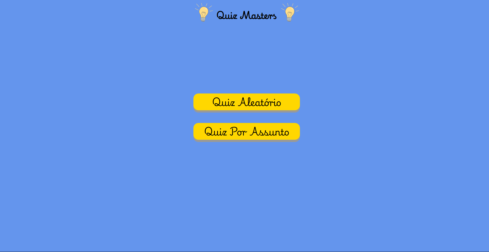
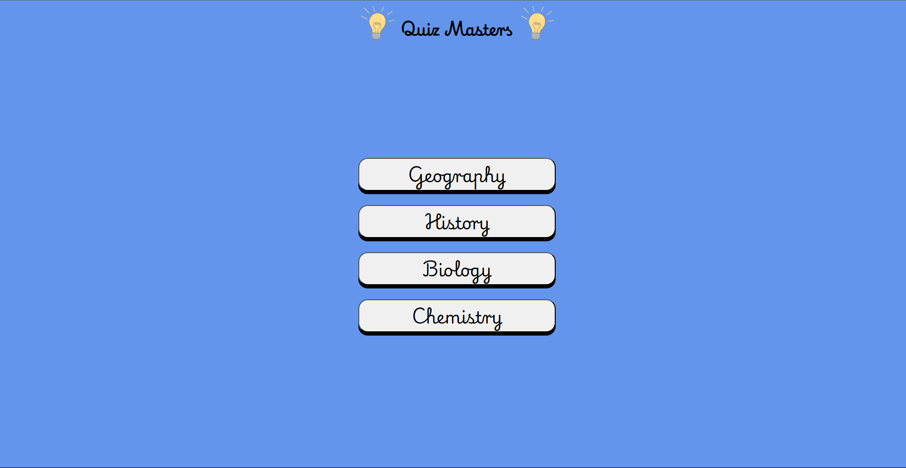
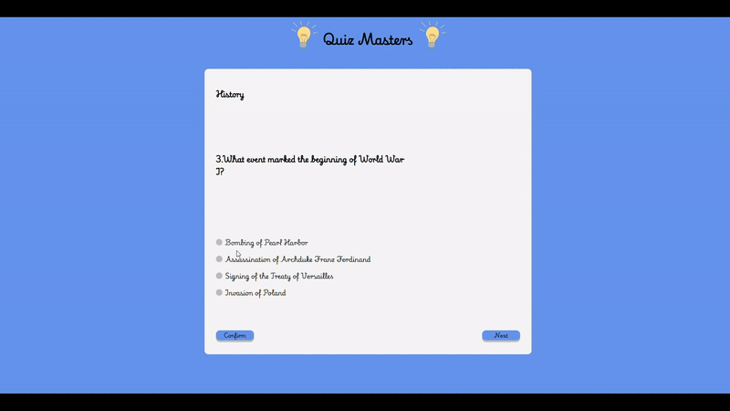
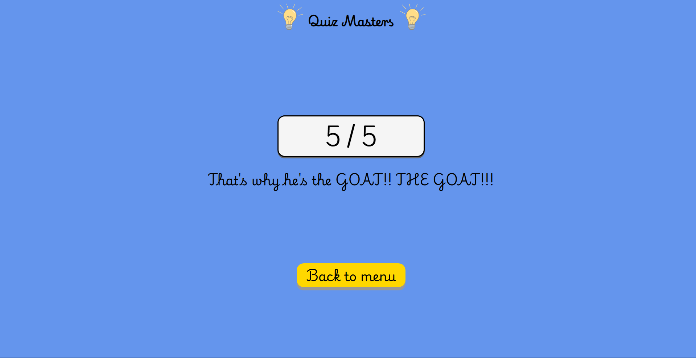

# Quiz Masters
# Made in Angular 19 and Java 17

## Goal
The main goal was to study Angular and Java project structures
when used as a Frontend and Backend.

## Frameworks and languages
- *Frontend*: Angular, JavaScript, CSS, HTML.
- *Backend*: Java, Spring Boot.

## Demo

Main Menu

Choose Subject Menu

Quiz Tab

Quiz Results Tab

# Conclusions

## Frontend
- Compared to ReactJS, Angular is much more structured and has way more built in
functionalities.
- Shared Services are simpler to read and code, such as how you would share information
between components.
- Not needed to use multiple libraries, which can be bad for performance and overrall management.

## Backend
- I would define Spring Boot very similarly as ASP .NET Core (which i am more familiar using).
Structure wise, it's very similar and sometimes even coding.
- Performance is ok, although not tested in a real environment such as Azure or AWS. But
for a simple backend such as this one, it's more than fine.
- At least in this Java version, there are a lot of built in functionalities that
makes the development easier, although it's also necessary to keep track of code simplicity
and readability.